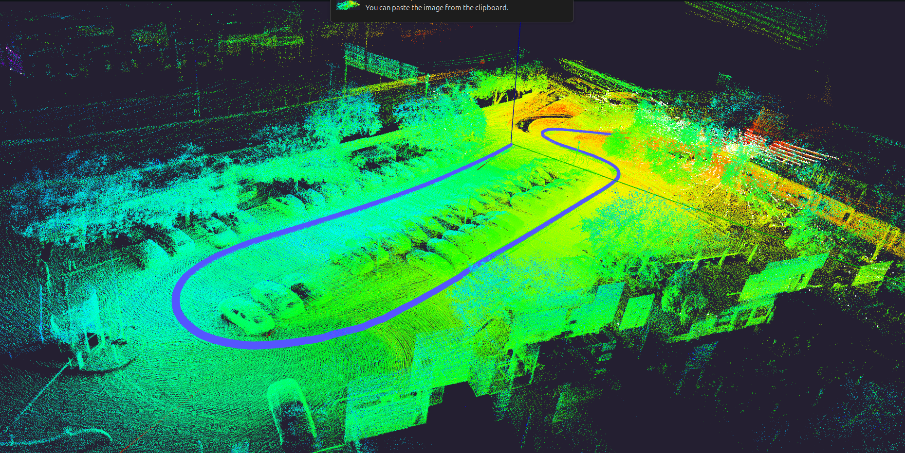

<div align="center">
  <h1>LiDAR–Inertial Odometry </h1>
  <h2>LIO: A Robust and Efficient LiDAR-Inertial Odometry System with a Compact Mapping Strategy</h2>
  <br>

## Overview

robust and efficient LiDAR–Inertial Odometry (LIO) system designed for real-time and large-scale autonomous navigation. This includes an optional loop closure extension (`SuperLIOLoop`) built on a GTSAM iSAM2 pose graph and ICP-based loop verification.



## Quickly Run

### Requirements

Ubuntu 24(22).04 · C++20 · ROS Jazzy(Humble) · Eigen · PCL

### Dependencies

glog · TBB

```bash
sudo apt install libgoogle-glog-dev libtbb-dev
#GTSAM librari
sudo add-apt-repository ppa:borglab/gtsam-release-4.1
sudo apt update
sudo apt install libgtsam-dev libgtsam-unstable-dev
```

### Build & Run

```bash
colcon build --packages-select basic
source install/setup.bash
# lidar+imu odometry
colcon build --packages-select lidar_odom
# semantic slam
colcon build --packages-select semantic_lidar_slam
#
colcon build --packages-select multicamera_lidar_calibration

colcon build --packages-select lio_localization

source install/setup.bash

ros2 launch lidar_odom Livox_mid360_loop.py

ros2 launch semantic_lidar_slam Livox_mid360_loop.py

ros2 launch multicamera_lidar_calibration multiprocessing.launch.py

ros2 launch lio_localization relocation.py


```

```bash
colcon build --packages-select basic
source install/setup.bash

# lidar+imu odometry
colcon build --packages-select lidar_odom \
  --parallel-workers 1 \
  --cmake-args -DCMAKE_BUILD_PARALLEL_LEVEL=2

# lidar localization
colcon build --packages-select lio_localization \
  --parallel-workers 1 \
  --cmake-args -DCMAKE_BUILD_PARALLEL_LEVEL=2

# lidar semantic slam
colcon build --packages-select semantic_lidar_slam \
  --parallel-workers 1 \
  --cmake-args -DCMAKE_BUILD_PARALLEL_LEVEL=2

# lidar camera calibration
colcon build --packages-select multicamera_lidar_calibration \
  --parallel-workers 1 \
  --cmake-args -DCMAKE_BUILD_PARALLEL_LEVEL=2

```

---

**Key parameters** (in `config/livox_360.yaml`):

```yaml
# --- Loop Closure ---
lio.loop.enable: true
lio.loop.frequency: 1.0 # Hz  — how often the loop thread runs
lio.loop.keyframe_add_dist: 1.0 # m   — save a keyframe every 1m of travel
lio.loop.keyframe_add_angle: 0.2 # rad — or every ~11° of rotation
lio.loop.search_radius: 15.0 # m   — KD-tree radius for candidate search
lio.loop.search_time_diff: 30.0 # s   — candidate must be at least this old
lio.loop.search_num: 25 # half-width of neighbour keyframes for ICP local map
lio.loop.fitness_score: 0.6 # ICP acceptance threshold (lower = stricter)
lio.loop.icp_leaf_size: 0.4 # m   — voxel leaf size for ICP cloud downsampling

# --- Sliding-window local map ---
lio.local_map.enable: false # true = bounded RAM mode
lio.local_map.radius: 50.0 # m   — keep keyframes within this radius of the robot
lio.local_map.prune_interval: 10 # prune every N new keyframes
```

**Use cases:**

| Mode                              | Config                                         |
| --------------------------------- | ---------------------------------------------- |
| Pure odometry, bounded RAM        | `local_map.enable: true`, `loop.enable: false` |
| Loop closure + bounded RAM        | `local_map.enable: true`, `loop.enable: true`  |
| Full mapping (original behaviour) | `local_map.enable: false`                      |

**Detailed config for each mode:**

_Pure odometry — save RAM, no map file written to disk:_

```yaml
lio.map.save_map: false
lio.local_map.enable: true
lio.local_map.radius: 50.0
lio.local_map.prune_interval: 10
lio.loop.enable: false
```

_Odometry Loop closure + bounded RAM:_

```yaml
lio.map.save_map: false
lio.local_map.enable: true
lio.local_map.radius: 100.0 # larger window so ICP still has enough context
lio.loop.enable: true
```

_Full mapping, original behaviour:_

```yaml
lio.map.save_map: true
lio.local_map.enable: false
lio.loop.enable: true # or false
```

---

## LiDAR Frequency Notes

The system adapts automatically to different LiDAR scan rates. No code changes are needed when switching frequencies — only YAML parameters may need tuning.

**Current setup: 10 Hz (Velodyne 32)**

| Scan rate | Scan duration | IMU states/scan (100 Hz IMU) | Normal overflow | Overflow warning threshold |
| --------- | ------------- | ---------------------------- | --------------- | -------------------------- |
| 10 Hz     | 100 ms        | ~11                          | 5–15 %          | ~15 % _(auto)_             |
| 20 Hz     | 50 ms         | ~6                           | 10–25 %         | ~25 % _(auto)_             |
| 40 Hz     | 25 ms         | ~3–4                         | 20–45 %         | ~45 % _(auto)_             |

**What "overflow" means:** The last IMU packet in a scan batch always lands 0–10 ms before the scan end (random phase gap at 100 Hz IMU). Points in that uncovered tail are extrapolated from the last known IMU state. This is expected and handled automatically — the warning only fires when overflow exceeds `IMU_period / scan_duration + 5 %`, which flags genuinely missing IMU data.

**Map initialisation** waits for 300 ms of scan data regardless of frequency (3 frames at 10 Hz, 6 frames at 20 Hz, etc.).

**What to change in YAML when switching frequency:**

```yaml
# No frequency parameter needed — the system detects it from incoming scans.
# Review these if you change the LiDAR:

lio.ros.lidar_topic: "/velodyne_points" # topic name for your sensor
lio.sensor.lidar_type: 4 # 2=HESAI16, 3=VELO16, 4=VELO32, 6=OUSTER

# At higher frequency you may want a tighter keyframe distance (less travel per frame):
lio.loop.keyframe_add_dist: 1.0 # m — consider 0.5 m at 20 Hz+ for denser keyframes

# Local map prune can run more often at higher frequency (more keyframes/second):
lio.local_map.prune_interval: 10 # keyframes between prunes — keep or reduce at 20 Hz+
```

**RViz topics published by SuperLIOLoop:**

| Topic                                 | Type                             | Description                                    |
| ------------------------------------- | -------------------------------- | ---------------------------------------------- |
| `/super_lio/corrected_path`           | `nav_msgs/Path`                  | Live trajectory, updated every keyframe        |
| `/super_lio/loop_closure_constraints` | `visualization_msgs/MarkerArray` | Loop edges, published after each accepted loop |
